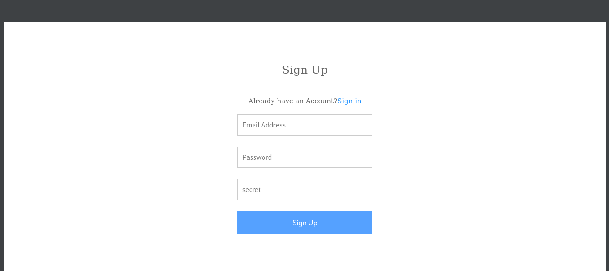
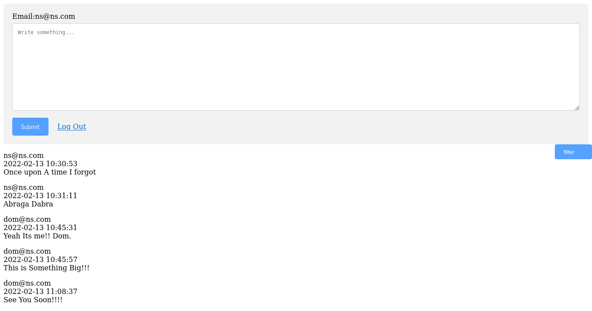

# Zoho Assesment - Comment System
---------------------------------

## Installation Guide :
-----------------------

1. Install Xampp on Either Windows/Linux.
2. Install PhpMyadmin (for linux using apt-get install phpmyadmin).
3. Start Xampp/Lamp (linux in mycase) with sudo /opt/lamp/lamp start.
4. Goto Phpmyadmin login with credentials you provide during installation.
5. Create New Database with name 'LoginSystem'.
6. Select LoginSystem -> goto Import tab -> Click Browse -> then upload LoginSystem.sql file.
7. Move All files into /opt/lampp/htdocs/zoho/ (copy that into www directory, if you are using wamp).
8. create directory name images, then move that .ico file into images directory.
8. All Done.
9. Now Goto Chrome/Firefox Type localhost/zoho{folder_name}/registration.php (To register new Account).

## Configuration:
-----------------

1. Default PhpMyAdmin Credential : username:'root' password:'' Database:'LoginSystem'.

## Todo:
--------

1. Filter Option.

## Screenshots:
---------------

